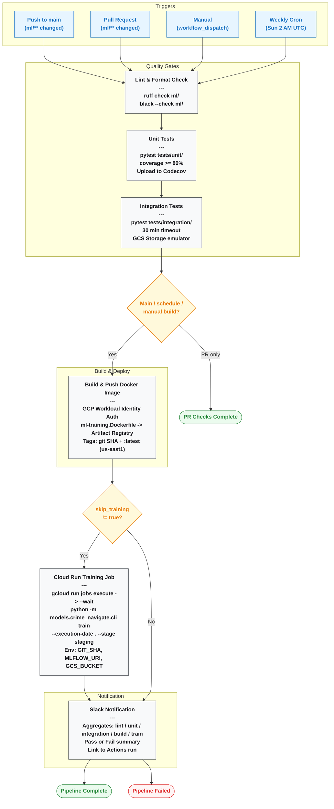

# Boston Pulse — ML training

This directory is the **Python package and tooling for training and publishing ML models for Boston Pulse**.

## Architecture
The ML pipeline is separate from the Airflow data pipeline: **the data pipeline produces curated features in GCS**; **this package consumes those features (making it decopled)**, trains a model, runs quality and fairness gates, and writes scores and metadata back to GCS and Firestore for serving.

For how raw data becomes features, lineage, and bucket layout on the **ingest side**, start with the data pipeline docs:

- [`../data-pipeline/README.md`](../data-pipeline/README.md) — quickstart, structure, reproducibility (GCS + lineage)
- [`../data-pipeline/CONTRIBUTING.md`](../data-pipeline/CONTRIBUTING.md) — contributor workflow

---

## Role in the overall system

| Layer | Responsibility |
|--------|----------------|
| **`data-pipeline/`** | Ingest → validate → preprocess → **feature tables** in GCS; lineage records; bias reporting at the data layer where applicable. |
| **`ml/`** | Load **features** for a date → build training labels → tune/train LightGBM → validate (RMSE, overfit, SHAP) → bias checks → push model to Artifact Registry → score H3 cells → publish to Firestore. |
| **`backend/` / `frontend/`** | Serve APIs and UI; consume scores and other services (see root README). |

---

## ML Training Pipeline Architecture



## Repository layout (`ml/`)

```text
ml/
├── pyproject.toml          # Package metadata, deps, pytest/ruff/black config
├── Makefile                # install, test, lint, format, local MLflow
├── README.md               # This file
├── docker/
│   └── ml-training.Dockerfile   # Training image; build context = repo root (see file header)
├── configs/
│   └── crime_navigate_train.yaml   # Thresholds, bucket prefixes, MLflow, registry, Firestore, etc.
├── models/
│   ├── __init__.py
│   └── crime_navigate/     # Navigate crime-risk pipeline
│       ├── cli.py          # Training CLI (entrypoint for Cloud Run / local)
│       ├── feature_loader.py
│       ├── target_builder.py
│       ├── tuner.py
│       ├── trainer.py
│       ├── validator.py
│       ├── bias_checker.py
│       ├── scorer.py
│       └── publisher.py
├── shared/                 # Cross-cutting utilities
│   ├── gcs_loader.py       # GCS I/O
│   ├── config_loader.py
│   ├── registry.py         # Model Artifact Registry + GCS metadata patterns
│   ├── artifact_registry.py
│   ├── mlflow_utils.py
│   ├── alerting.py
│   ├── schemas.py          # Result dataclasses for pipeline steps
│   ├── bias_utils.py
│   └── vertex_runner.py    # Optional Vertex AI job submission (config-driven)
└── tests/
    ├── conftest.py
    ├── unit/               # models + shared unit tests
    └── integration/        # Heavier or integration-style tests
```

---


**Environment:** set `GCS_BUCKET` / `GCP_PROJECT_ID` and related vars as documented in `infrastructure/SECRETS.md` at repo root. MLflow tracking URI can point to a managed backend or local SQLite for experiments.

---

## CI/CD (`.github/workflows/ml.yml`)

Workflow file: **[`.github/workflows/ml.yml`](../.github/workflows/ml.yml)** (triggers on changes under `ml/**` or the workflow file).

Rough flow:

1. **Lint** (ruff + black check)
2. **Unit tests** (pytest, coverage)
3. **Integration tests**
4. **Build & push** image to Artifact Registry (`us-east1-docker.pkg.dev/.../ml-images/ml-training`) — on `main` push, schedule, or manual dispatch (unless `skip_image_build`)
5. **Cloud Run Job** — updates the job image and runs `python -m models.crime_navigate.cli train ...` with `--wait`
6. **Notify** — Slack summary; the job fails if any upstream job failed or was cancelled

Scheduled run: **weekly (Sunday 02:00 UTC)** per cron in the workflow.

Manual **workflow_dispatch** inputs allow `execution_date`, `skip_training`, and `skip_image_build`.

---

## Design principles (summary)

1. **Separation from ETL** — `ml/` reads pipeline outputs via **GCS** and config, not by importing Airflow DAG code.
2. **Gates block promotion** — validation and bias failures stop the pipeline.
3. **Config-first** — thresholds and paths live in YAML.
4. **Same container locally and in GCP** — Dockerfile + CLI keep dev/prod entrypoints aligned.
5. **Traceability** — MLflow for experiments; registry + env vars (`GIT_SHA`, `ML_IMAGE`) for tying runs to code and image.

---

## Further reading

- Root overview: [`../README.md`](../README.md)
- Data pipeline: [`../data-pipeline/README.md`](../data-pipeline/README.md)
- Infra secrets / WIF / Cloud Run naming: [`../infrastructure/SECRETS.md`](../infrastructure/SECRETS.md)
